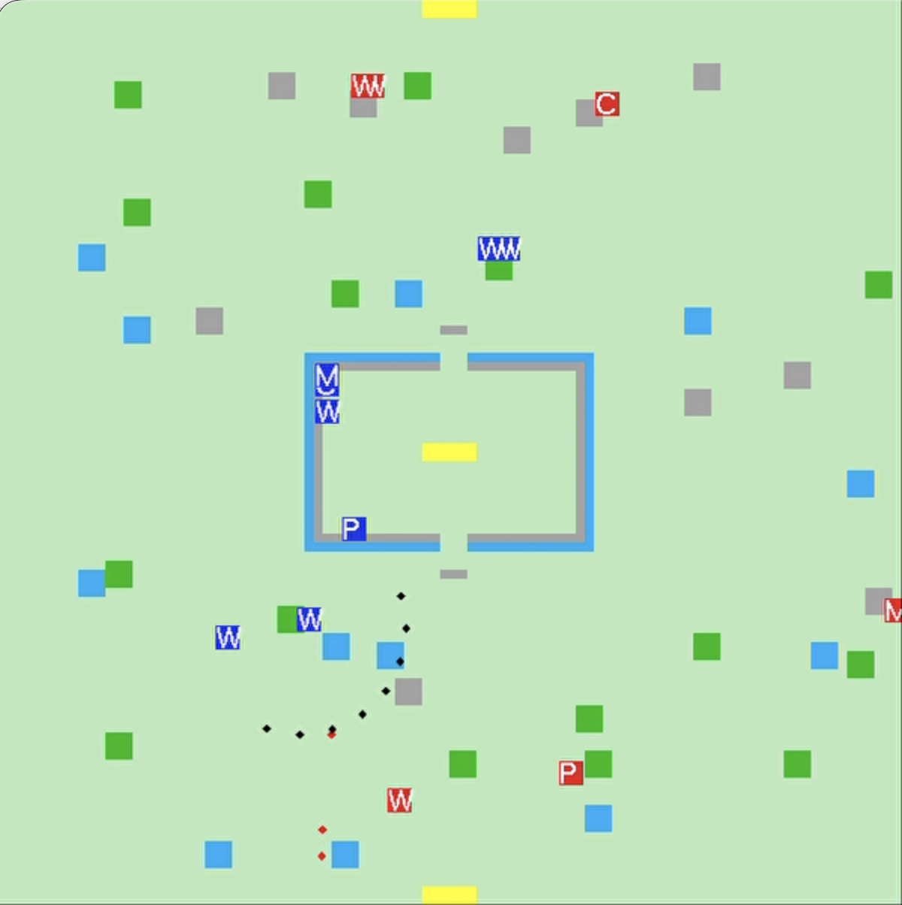

# AI Army Simulation

<p align="center">
  
</p>

## Overview

AI Army Simulation is a graphical Artificial Intelligence project that simulates a battle between two armies on a two-dimensional grid map.

In the simulation, one army defends a fortress, while the other army attacks and tries to conquer it.  
Each army contains autonomous virtual characters with different roles, such as a commander, warriors, a medic, and a provider.

The characters are able to move across the map, detect enemies, plan paths, attack, retreat, request medical assistance, request ammunition supply, and react to changes during the battle.

The main goal of the defending army is to protect the fortress and survive, while the attacking army tries to eliminate the defenders and take control of the fortress.

## Project Goal

The goal of this project is to demonstrate intelligent behavior of virtual characters using Artificial Intelligence algorithms and decision-making techniques.

The project includes:

- Path planning using the A* algorithm.
- Searching for safe defensive or retreat positions using BFS.
- Building and using a visibility map.
- Building and using a safety/security map.
- Real-time decision-making during the battle.
- Communication between soldiers and the commander.
- Autonomous behavior for warriors, medics, and providers.
- Attack and defense behavior around a fortress.

## Main Features

- Two opposing armies: defense and attack.
- Fortress-based battle scenario.
- Autonomous soldiers with different roles.
- Grid-based map with obstacles and terrain types.
- Pathfinding with A*.
- BFS-based search for safe positions.
- Field of vision and line-of-sight detection.
- Shooting and grenade mechanics.
- Medical assistance for injured soldiers.
- Ammunition supply behavior.
- Commander-based decision-making.
- Automatic simulation without manual control of the soldiers.

## Character Types

Each army includes several types of characters.

### Commander (`C`)

The commander is responsible for managing the army.

The commander receives information from the soldiers, builds a wider understanding of the battlefield, receives reports about enemies, injuries, and low ammunition, and sends commands to the other units.

The commander does not directly participate in combat, but is responsible for the main decision-making of the army.

### Warrior (`W`)

The warriors are the fighting units of the army.

Warriors can:

- Move to different positions.
- Detect enemies.
- Shoot.
- Throw grenades.
- Advance according to commands.
- Switch to defensive behavior.
- Search for safer positions when needed.
- Continue acting more independently if the commander is eliminated.

When a warrior is injured or has low ammunition, the warrior can report it so that help can be provided.

### Medic (`M`)

The medic is responsible for helping injured soldiers.

When a medic receives a relevant command, the medic moves toward a storage area and then toward the injured soldier in order to heal him and return him to active behavior.

### Provider (`P`)

The provider is responsible for supplying ammunition to warriors.

When a warrior needs ammunition, the provider moves toward a storage area and then toward the warrior that needs supply.

## Map

The simulation takes place on a two-dimensional grid map.

The map contains several terrain types:

- Regular ground — characters can move through it.
- Rocks — characters cannot pass through them, and they block vision and shooting.
- Trees — characters can pass through them, but they block vision and shooting.
- Water — characters cannot move through it, but vision and shooting can pass through it.
- Warehouses / storage areas — used for support actions such as supply and medical assistance.
- Fortress area — the central area protected by the defending army and attacked by the attacking army.

Each character is displayed as a colored square with a letter representing its role.

## AI Components

### 1. A* Pathfinding

The characters use the A* algorithm to find a path from their current location to a target location.

The path calculation considers obstacles and safety costs.  
This means that the characters do not only search for the shortest path, but also try to choose a safer path when possible.

Examples of A* usage:

- A warrior moves to an attack position.
- A warrior advances to a new position.
- A medic moves toward a storage area and then toward an injured soldier.
- A provider moves toward a storage area and then toward a soldier that needs ammunition.
- A character searches for a safer route to reduce the chance of being hit.

### 2. BFS Search

BFS is used when the target position is not known in advance.

For example, when a warrior needs to defend or retreat, the warrior can search for a nearby safe position.  
After a suitable position is found, the character can move toward it using path planning.

### 3. Visibility Map

Each soldier has its own field of vision.

A soldier can detect enemies only if there is a clear line of sight between the soldier and the enemy.  
Obstacles such as rocks and trees can block visibility.

The commander can use the information reported by the soldiers to create a wider view of the battlefield.

### 4. Safety / Security Map

The project uses a safety map to estimate which areas are safer or more dangerous.

Dangerous areas receive a higher movement cost, so characters prefer to avoid them while planning their paths.

This helps the characters choose smarter movement routes instead of simply choosing the shortest path.

### 5. Real-Time Decision Making

The characters react to the current battle situation in real time.

For example:

- If an enemy is detected, warriors can attack.
- If a warrior is injured, assistance can be requested from the medic.
- If a warrior has low ammunition, supply can be requested from the provider.
- If the danger level is high, warriors can move to safer positions.
- If the commander is eliminated, warriors can continue acting more independently.

## Winning Conditions

The simulation ends when one of the armies loses the ability to continue fighting.

- If the attacking army is eliminated, the defending army wins.
- If the defending army is eliminated, the attacking army wins and takes control of the fortress.
- If both armies are eliminated, the result is a draw.

The result is printed when the simulation ends.

## Technologies

- Programming Language: C++
- Development Environment: Microsoft Visual Studio
- Graphics: OpenGL / GLUT
- External Libraries:
  - FreeGLUT
  - GLEW

## Project Structure

Recommended repository structure:

```text
AI-Army-Simulation/
├── README.md
├── .gitignore
├── demo/
│   └── ai-army-simulation-demo.mp4
├── images/
│   └── screenshot.png
└── Graphics/
    ├── Graphics.sln
    └── Graphics/
        ├── main.cpp
        ├── Definitions.h
        ├── Soldier.h
        ├── Soldier.cpp
        ├── Bullet.h
        ├── Bullet.cpp
        ├── Grenade.h
        ├── Grenade.cpp
        ├── freeglut.h
        ├── freeglut.lib
        ├── glew.h
        ├── glew32.lib
        └── ...
```

## Main Files

- `main.cpp` — initializes the map, creates the environment, places the armies, runs the simulation loop, draws the map, and manages the battle.
- `Definitions.h` — contains constants, map tile types, soldier amounts, speed values, and general definitions.
- `Soldier.h / Soldier.cpp` — contains the soldier classes and the main AI behavior of the commander, warriors, medic, and provider.
- `Bullet.h / Bullet.cpp` — handles bullets, shooting, bullet movement, and collision with soldiers or obstacles.
- `Grenade.h / Grenade.cpp` — handles grenades, explosions, and security map calculations.
- `Graphics.sln` — Visual Studio solution file used to open and run the project.

## How to Run

### Requirements

- Windows
- Microsoft Visual Studio
- OpenGL
- FreeGLUT
- GLEW

### Run with Visual Studio

1. Open the solution file:

```text
Graphics/Graphics.sln
```

2. Select the correct configuration, for example:

```text
Debug | Win32
```

3. Build the project.

4. Run the project using Visual Studio.

After running the project, a window named:

```text
AI Army Simulation
```

will open.

## Controls

The simulation runs automatically.

Available controls:

- Left mouse click — creates a grenade at the clicked position.
- Right mouse click — opens a menu with the following options:
  - Create Security Map
  - Show Security Map
  - Show Map

## Demo Video

A demonstration video of the project is available here:

```text
demo/ai-army-simulation-demo.mp4
```

The video shows the simulation running and demonstrates the behavior of the characters during the battle.

## Notes

This project demonstrates the combination of several AI behaviors in one simulation:

- Path planning.
- Enemy detection.
- Team coordination.
- Attack and defense behavior.
- Fortress protection and conquest.
- Reaction to changing situations.
- Autonomous decision-making.
- Combining combat, support, survival, and movement logic.

The project was developed as a final project for the Artificial Intelligence course.